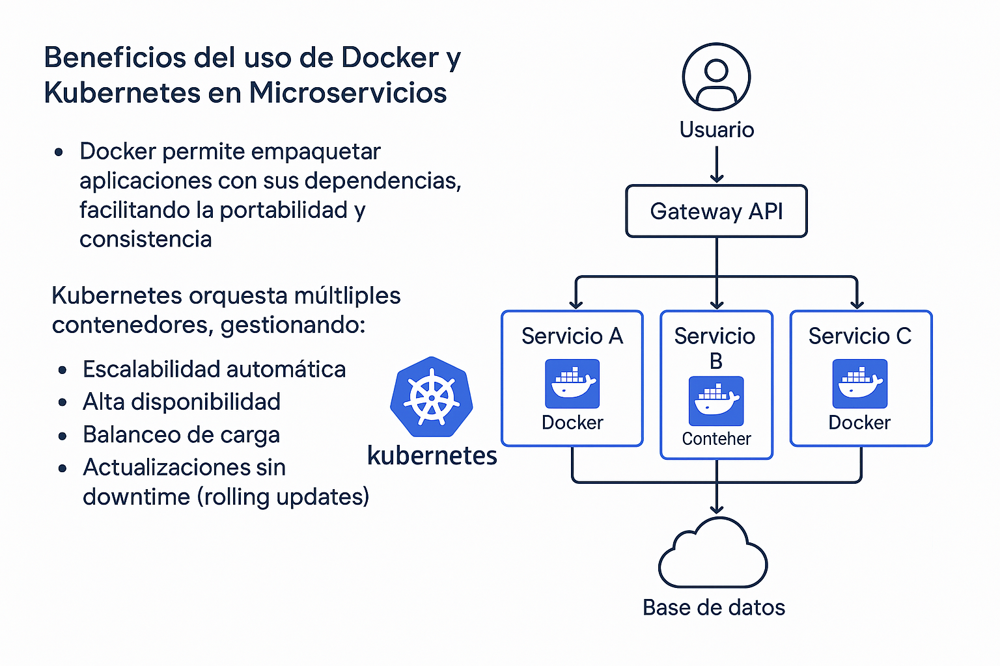
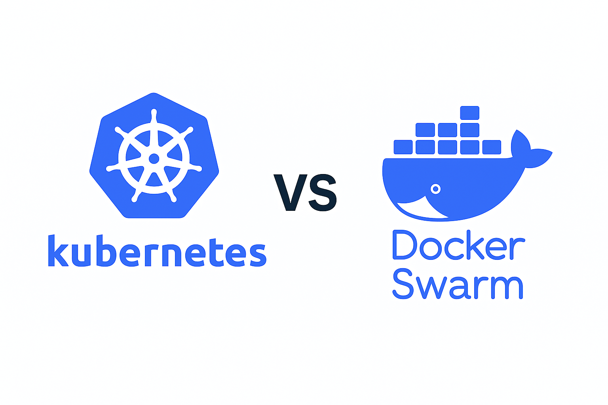
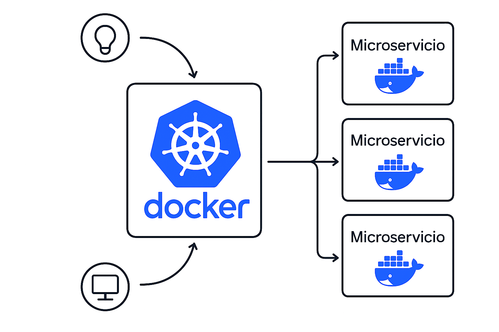
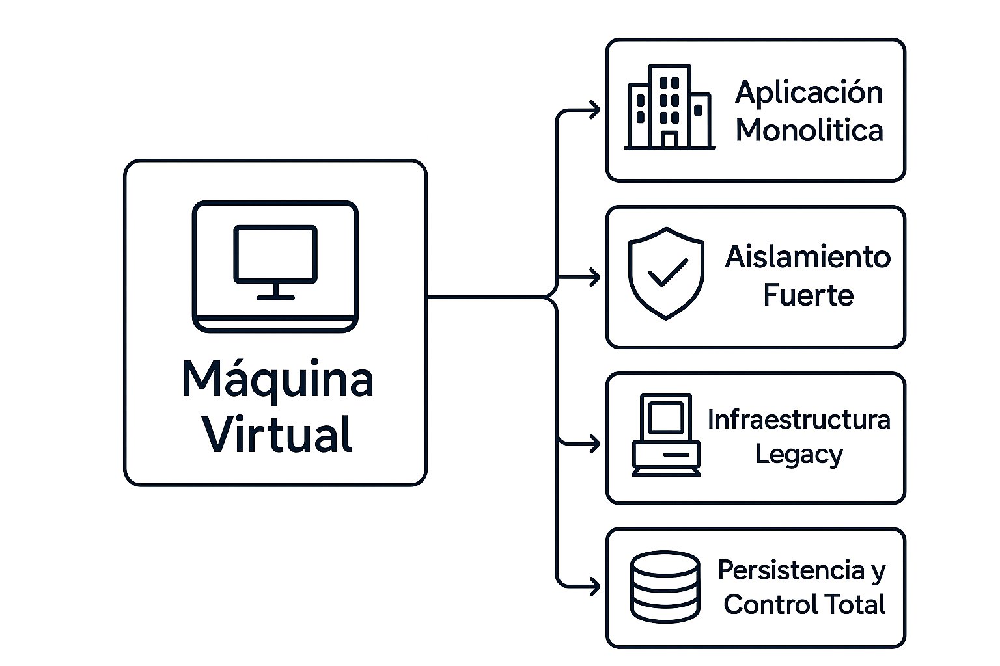

# Docker vs Máquinas Virtuales — Comparativa Técnica Profunda

### Introducción

En el mundo moderno de la infraestructura TI, la elección entre **contenedores** y **máquinas virtuales (VMs)** es crucial para el diseño de arquitecturas eficientes, escalables y seguras. Este documento explora a fondo las diferencias, beneficios, casos de uso y desafíos de ambas tecnologías, con énfasis en **Docker**, **Kubernetes** y su papel en arquitecturas de microservicios.

---

### 1. Diferencias Fundamentales: Contenedores vs Máquinas Virtuales

#### Virtualización
- **Contenedores** virtualizan a nivel del sistema operativo, compartiendo el mismo kernel entre múltiples instancias. Esto los hace más ligeros y rápidos.
- **Máquinas virtuales** virtualizan a nivel de hardware, emulando un sistema completo con su propio kernel, lo que proporciona mayor aislamiento pero consume más recursos.

#### Peso
- **Contenedores** son livianos, ocupando apenas unos megabytes, ya que no incluyen un sistema operativo completo.
- **VMs** son pesadas, ya que cada una incluye su propio sistema operativo, lo que puede ocupar varios gigabytes.

#### Tiempo de arranque
- **Contenedores** arrancan en segundos gracias a su arquitectura ligera.
- **VMs** pueden tardar minutos en iniciar, debido a la carga del sistema operativo completo.

#### Aislamiento
- **Contenedores** ofrecen aislamiento parcial, ya que comparten el kernel del host. Esto puede representar riesgos si no se configuran adecuadamente.
- **VMs** proporcionan aislamiento completo, cada una con su propio kernel, lo que mejora la seguridad y la separación entre entornos.

#### Portabilidad
- **Contenedores** son altamente portables: una imagen Docker puede ejecutarse en cualquier host compatible sin modificaciones.
- **VMs** tienen portabilidad limitada, ya que dependen del hipervisor y del formato de la imagen (VMDK, QCOW2, etc.).

#### Seguridad
- **Contenedores** requieren medidas adicionales de seguridad (como namespaces, cgroups, escaneo de imágenes) debido a su menor aislamiento.
- **VMs** son más seguras por diseño, al tener separación total entre sistemas, lo que reduce el riesgo de ataques entre entornos.

#### Uso de recursos
- **Contenedores** utilizan los recursos de forma eficiente, compartiendo el kernel y evitando duplicación de procesos.
- **VMs** consumen más recursos, ya que cada instancia ejecuta su propio sistema operativo y servicios base.

#### Persistencia
- **Contenedores** son efímeros por defecto; los datos deben almacenarse en volúmenes externos si se desea persistencia.
- **VMs** tienen persistencia integrada, con discos virtuales que conservan el estado del sistema y los datos.

#### Resumen:

| Característica              | Contenedores (Docker)                          | Máquinas Virtuales (VMs)                        |
|----------------------------|------------------------------------------------|------------------------------------------------|
| Virtualización             | A nivel de sistema operativo                   | A nivel de hardware                             |
| Peso                       | Ligero (MBs)                                   | Pesado (GBs)                                    |
| Tiempo de arranque         | Segundos                                       | Minutos                                         |
| Aislamiento                | Parcial (comparten kernel)                     | Completo (kernel independiente)                 |
| Portabilidad               | Alta (imagen ejecutable en cualquier host)     | Media (dependencia de hipervisor)              |
| Seguridad                  | Menor aislamiento, requiere hardening          | Mayor aislamiento por diseño                    |
| Uso de recursos            | Eficiente                                      | Intensivo                                       |
| Persistencia               | Volátil por defecto                            | Persistente                                     |

---

### 2. Beneficios del uso de Docker y Kubernetes en Microservicios



### ¿Qué es Kubernetes?

**Kubernetes** es una plataforma de orquestación de contenedores de código abierto que automatiza el despliegue, escalado, gestión y operación de aplicaciones en contenedores. Fue originalmente desarrollado por Google y ahora es mantenido por la Cloud Native Computing Foundation (CNCF). Kubernetes permite definir cómo deben comportarse los contenedores, cómo se comunican entre sí, cómo se escalan y cómo se recuperan ante fallos.

---

- **Docker** permite empaquetar aplicaciones con sus dependencias, facilitando la portabilidad y consistencia.
- **Kubernetes** orquesta múltiples contenedores, gestionando:
  - Escalabilidad automática
  - Alta disponibilidad
  - Balanceo de carga
  - Actualizaciones sin downtime (rolling updates)
- Ideal para arquitecturas **microservicio**, donde cada componente se despliega como un contenedor independiente.

### Ejemplo de Infraestructura de Microservicios

Imagina una aplicación de comercio electrónico compuesta por varios servicios independientes, cada uno desplegado como un contenedor gestionado por Kubernetes:

- **Frontend Web**: React o Angular, desplegado como contenedor.
- **Servicio de Autenticación**: API en Node.js que gestiona login y tokens.
- **Servicio de Productos**: Microservicio en Python que consulta una base de datos.
- **Servicio de Carrito de Compras**: Microservicio en Go que mantiene el estado del carrito.
- **Servicio de Pagos**: Microservicio en Java que se comunica con pasarelas externas.
- **Base de Datos**: PostgreSQL o MongoDB, desplegado como StatefulSet.
- **Redis**: Para caché y sesiones.
- **Kubernetes Ingress**: Para enrutar tráfico HTTP a los servicios correctos.
- **Prometheus + Grafana**: Para monitoreo.
- **Cert-Manager**: Para certificados TLS automáticos.

Cada uno de estos servicios se despliega como un **Pod** en Kubernetes, agrupado en **Deployments**, expuesto mediante **Services**, y gestionado por reglas de escalado automático y recuperación ante fallos.

---

### 3. Orquestadores de Contenedores

Los orquestadores de contenedores permiten gestionar múltiples contenedores distribuidos en diferentes nodos, automatizando tareas como el despliegue, escalado, monitoreo y recuperación ante fallos. Los dos más conocidos son **Kubernetes** y **Docker Swarm**.

---

#### Kubernetes

**Kubernetes** es el orquestador más robusto y ampliamente adoptado en la industria. Sus principales funcionalidades incluyen:

- **Arquitectura basada en clústeres**: compuesta por un nodo maestro y múltiples nodos de trabajo.
- **Componentes clave**:
  - `Pod`: unidad mínima de ejecución que contiene uno o más contenedores.
  - `Deployment`: gestiona el ciclo de vida de los Pods, incluyendo actualizaciones.
  - `Service`: expone Pods internamente o externamente.
  - `Ingress`: gestiona el acceso HTTP/HTTPS desde el exterior.
  - `ConfigMap` y `Secret`: permiten la gestión de configuración y credenciales de forma segura.
- **Escalabilidad automática**: ajusta el número de réplicas según la carga.
- **Alta disponibilidad**: distribuye cargas y reinicia Pods fallidos automáticamente.
- **Rolling updates y rollbacks**: actualizaciones sin downtime y reversión en caso de error.
- **Integración con CI/CD**: compatible con herramientas como Jenkins, GitLab CI, ArgoCD.
- **Monitoreo y logging**: integración con Prometheus, Grafana, Fluentd, etc.
- **Gestión de volúmenes persistentes**: soporte para almacenamiento dinámico.

---

#### Docker Swarm

**Docker Swarm** es el orquestador nativo de Docker, más simple y fácil de configurar. Sus funcionalidades principales son:

- **Integrado en Docker Engine**: no requiere instalación adicional.
- **Clúster de nodos**: con roles de manager y worker.
- **Servicios y stacks**: define servicios con múltiples réplicas y redes internas.
- **Balanceo de carga interno**: distribuye tráfico entre réplicas automáticamente.
- **Actualizaciones progresivas**: permite despliegues controlados.
- **Seguridad básica**: cifrado de comunicaciones entre nodos y gestión de secretos.
- **Menor curva de aprendizaje**: ideal para entornos pequeños o pruebas rápidas.
- **Limitaciones**: menos extensible, sin soporte nativo para Ingress, monitoreo avanzado o escalado automático.



---

### 4. Casos de Uso: ¿Cuándo usar contenedores vs máquinas virtuales?

#### 1. Microservicios
- **Docker** permite desplegar cada microservicio como un contenedor independiente, facilitando la escalabilidad, el aislamiento lógico y la portabilidad.
- Las **VMs** requieren más recursos para cada servicio, lo que complica la gestión de múltiples instancias pequeñas.

#### 2. CI/CD Pipelines
- **Docker** se integra fácilmente en pipelines de integración y entrega continua, permitiendo construir, testear y desplegar imágenes de forma automatizada.
- Las **VMs** son más lentas de provisionar y menos dinámicas para procesos automatizados.

#### 3. Aplicaciones Portables
- Las imágenes Docker contienen todo lo necesario para ejecutar una aplicación, lo que garantiza consistencia entre entornos (dev, test, prod).
- Las **VMs** dependen del sistema operativo y configuración del hipervisor, lo que puede generar incompatibilidades.

#### 4. Entornos de Desarrollo Aislados
- Con **Docker**, los desarrolladores pueden levantar entornos completos con un solo comando (`docker-compose up`), sin afectar el sistema host.
- Las **VMs** requieren instalación y configuración manual, lo que consume tiempo y recursos.



---

### Casos donde las Máquinas Virtuales siguen siendo preferibles

#### 1. Aplicaciones Monolíticas
- Las **VMs** son ideales para aplicaciones grandes que no se dividen fácilmente en microservicios.

#### 2. Aislamiento Fuerte
- Las **VMs** ofrecen aislamiento completo a nivel de kernel, lo que es esencial para entornos con requisitos de seguridad estrictos.

#### 3. Infraestructura Legacy
- Muchas aplicaciones heredadas están diseñadas para ejecutarse en sistemas operativos completos, lo que hace que las **VMs** sean la opción más compatible.

#### 4. Persistencia y Control Total
- Las **VMs** permiten un control total del sistema operativo, ideal para servicios que requieren configuraciones específicas o persistencia robusta.



---

### 5. Desafíos y Consideraciones de Seguridad

#### 🐳 Contenedores (Docker)

**Ventajas:**
- **Menor superficie de ataque**: al contener solo lo necesario para ejecutar una aplicación, se reduce el número de componentes vulnerables.
- **Actualizaciones rápidas**: puedes reconstruir y desplegar imágenes actualizadas fácilmente, lo que facilita la aplicación de parches de seguridad.
- **Aislamiento lógico**: mediante namespaces, cgroups y redes virtuales, se puede limitar el acceso entre contenedores.

**Desafíos:**
- **Compartición del kernel**: todos los contenedores comparten el kernel del host, lo que puede permitir escalamiento de privilegios si un contenedor es comprometido.
  - *Ejemplo*: un contenedor malicioso podría intentar explotar una vulnerabilidad en el kernel para acceder al sistema host.
- **Escaneo de imágenes**: es necesario escanear cada imagen en busca de vulnerabilidades (herramientas como Trivy, Clair, Snyk).
- **Gestión de secretos**: almacenar credenciales dentro de imágenes o variables de entorno es riesgoso. Se recomienda usar herramientas como HashiCorp Vault o Kubernetes Secrets.
- **Políticas de red**: sin una configuración adecuada, los contenedores pueden comunicarse libremente entre sí. Kubernetes permite aplicar políticas de red para restringir este comportamiento.

**Recomendaciones en entornos profesionales:**
- Usar contenedores no privilegiados.
- Aplicar políticas de seguridad con AppArmor, SELinux o seccomp.
- Integrar escaneo de imágenes en el pipeline CI/CD.
- Usar `read-only` file systems y limitar capacidades con `cap_drop`.

---

#### 🖥️ Máquinas Virtuales

**Ventajas:**
- **Aislamiento completo**: cada VM tiene su propio kernel, lo que impide que una aplicación comprometida afecte otras instancias o el host.
  - *Ejemplo*: si una aplicación en una VM es atacada, el daño queda contenido dentro de esa VM.
- **Control total del sistema operativo**: puedes aplicar configuraciones de seguridad específicas, firewalls, antivirus, etc.
- **Compatibilidad con herramientas tradicionales**: muchas soluciones de seguridad están diseñadas para sistemas operativos completos.

**Desafíos:**
- **Mayor superficie de ataque**: el hipervisor (como VMware, KVM, Hyper-V) puede ser un punto de vulnerabilidad si no se actualiza o configura correctamente.
- **Consumo de recursos**: aplicar medidas de seguridad como IDS/IPS, antivirus, cifrado de disco, etc., requiere más CPU y RAM.
- **Gestión compleja**: mantener múltiples VMs seguras implica más esfuerzo en parches, backups, monitoreo y auditoría.

**Recomendaciones en entornos profesionales:**
- Usar hipervisores con soporte empresarial y actualizaciones frecuentes.
- Aplicar segmentación de red y firewalls por VM.
- Implementar cifrado de disco y autenticación multifactor.
- Monitorear logs y tráfico con herramientas como OSSEC, Suricata o Wazuh.

---

## 🧰 Herramientas Fundamentales de Docker (Adicional)

### Dockerfile

**¿Qué es?**
El `Dockerfile` es un archivo de texto que contiene instrucciones para construir una imagen de Docker. Es como una receta que define qué sistema base usar, qué dependencias instalar, qué archivos copiar y qué comandos ejecutar.

**¿Cómo funciona?**
Docker lee el `Dockerfile` línea por línea y crea una imagen que puede ser ejecutada como un contenedor. Cada instrucción genera una capa en la imagen, lo que permite reutilización y eficiencia.

**Ejemplo de flujo:**
```Dockerfile
FROM python:3.10-slim      # Imagen base
WORKDIR /app               # Directorio de trabajo
COPY . /app                # Copia archivos al contenedor
RUN pip install flask      # Instala dependencias
CMD ["python", "app.py"]   # Comando de inicio
```

---

### Docker Compose

**¿Qué es?**
`docker-compose.yml` es un archivo que permite definir y ejecutar múltiples contenedores como un conjunto de servicios. Es ideal para aplicaciones que requieren varios componentes (por ejemplo, una API + base de datos).

**¿Cómo funciona?**
Con un solo comando (`docker-compose up`), se construyen las imágenes, se crean los contenedores, se configuran redes y se exponen puertos.

**Ejemplo de flujo:**
```yaml
version: '3.8'
services:
  web:
    build: .
    ports:
      - "5000:5000"
```

---

### Otras Herramientas de Docker

#### Docker CLI
- Comandos como `docker build`, `docker run`, `docker ps`, `docker exec` permiten gestionar contenedores desde la terminal.

#### Docker Hub
- Repositorio público donde puedes subir y descargar imágenes. Ejemplo: `python:3.10-slim`.

#### Docker Volumes
- Permiten persistencia de datos fuera del contenedor. Útiles para bases de datos o archivos que deben sobrevivir reinicios.

#### Docker Networks
- Gestionan la comunicación entre contenedores. Puedes definir redes privadas para aislar servicios.

---

### 🔬 Prueba de Concepto (PoC)

Despliegue comparativo de una API REST en Docker vs una máquina virtual Ubuntu Server. Se evalúan tiempos, recursos y facilidad de configuración.

[Prueba de Docker](/fastapi-docker-poc/PoC.md)
[Prueba de VM](/fastapi-docker-poc/PoC_vm.md)

